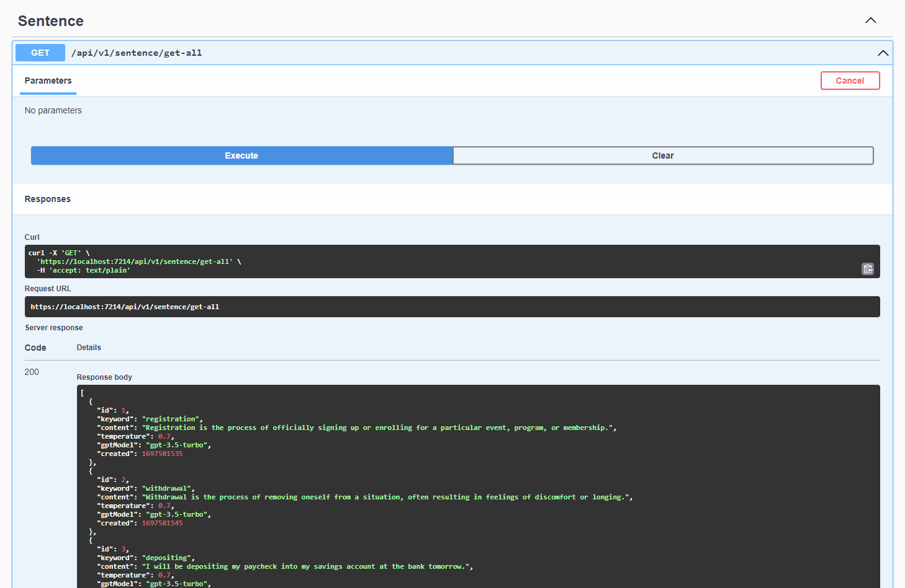

# Sentence Generator

Queries Chat GPT in order to generate a sentence given a keyword.

## How has this been implemented

- An API is used in order to test the main class library.
- Swagger is configured as a UI.
- The OpenAI API schema and definitions are used in order to query the ChatGPT API.
- The ChatGPT API is asked "write a sentence about [keyword]"
- An in-memory instance of entity framework is set up in order to mimic the storage of sentence instances within a database.

## To run the application

- Create an `appsettings.Development.json` file including `AppSettings:ClientSecretKey`.
- Secret keys can be generated at https://platform.openai.com/account/api-keys.
- Either run the application in Visual Studio with the API as the startup project, or by running the `dotnet run` command.
- Test the API via Swagger at `/swagger/index.html`.

## Endpoints

- GET: `/api/v1/sentence/get-all`
   - Retrieves all sentence objects from the database
- POST: `/api/v1/sentence`
   - Accepts a keyword to query ChatGPT and stores the sentence in the database

## Database schema

### Sentence

- Keyword - keyword used to query
- Created - created on ticks
- Content - the sentence that was generated
- GptModel - the model used in order to generate the sentence
- Temperature - the temperature (from 0 - 1) used to query

## Improvements/further work

- Could provide the format of the sentence as a config value
- Multiple keywords, queried multiple times, while only querying the third-party API once